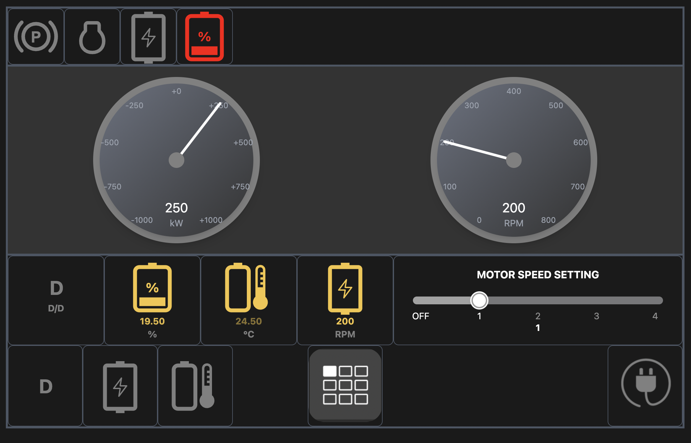

## Vehicle Dashboard Application Frontend

### Overview

This is a React.js application with TailwindCSS for styling. The application uses Recoil for state management and establishes a WebSocket connection for real-time updates.

Prerequisites:

- Node 21
- Tailwindcss 3
- Recoil
- React Router Dom 6

### Technical Design Document:

https://docs.google.com/document/d/1t4sMQC7izzmQ98fK74Y-Zo6FlTWfywD9GSzChE-UD9s/edit?usp=sharing

### API Documentation

For detailed API documentation, refer to the API Documentation.
https://secret-garden-38447-cfa420a113c0.herokuapp.com/api/v1/api-docs

## Features

- **WebSocket Connection**: The application establishes a WebSocket connection to receive real-time updates for battery information, metrics, and indicators.
- **API Calls**: The application sends API calls under specific conditions.

## User Interactions

- **Motor Speed Setting**: Users can adjust the motor speed settings.
- **Electric Charging Button**: Users can press the electric charging button to initiate charging.

## Local Dev Setup Instructions:
### **Run the application using Docker
-----------

Check this repository: https://github.com/curtiskim808/appianway-platform
This setup provides a simple development environment using Docker containers for both frontend and backend applications. If you are not familiar with Java or don't have a Java environment installed, this setup will help you get started quickly without additional configurations.

-----------
### Or, Run the application on your local machine

1. Install dependencies:

```bash
  npm install
# or
  yarn install
```

2. Set Your Environment Variables

Create a `.env` file in the root directory and add the following environment variables: (refer to .env.example)
(In your local, http://localhost:8080 would be your backend url)
```bash
  VITE_DASHBOARD_APP_API_URL=<backend-api-url>/api/v1/dashboards
  VITE_DASHBOARD_APP_WEBSOCKET_URL=<backend-api-url>/api/v1/ws
```

3. build and run for dev

```bash
  npm run dev
```

Visit your dev




